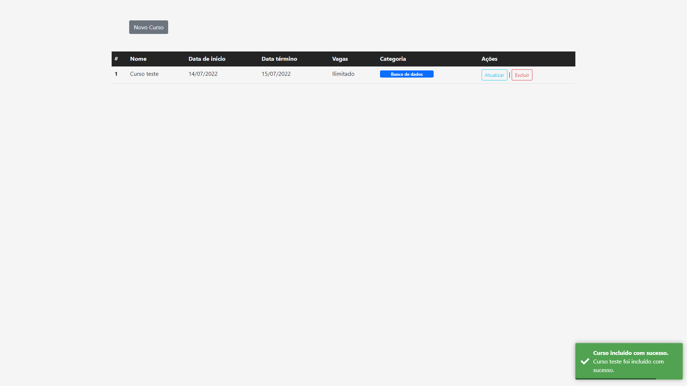
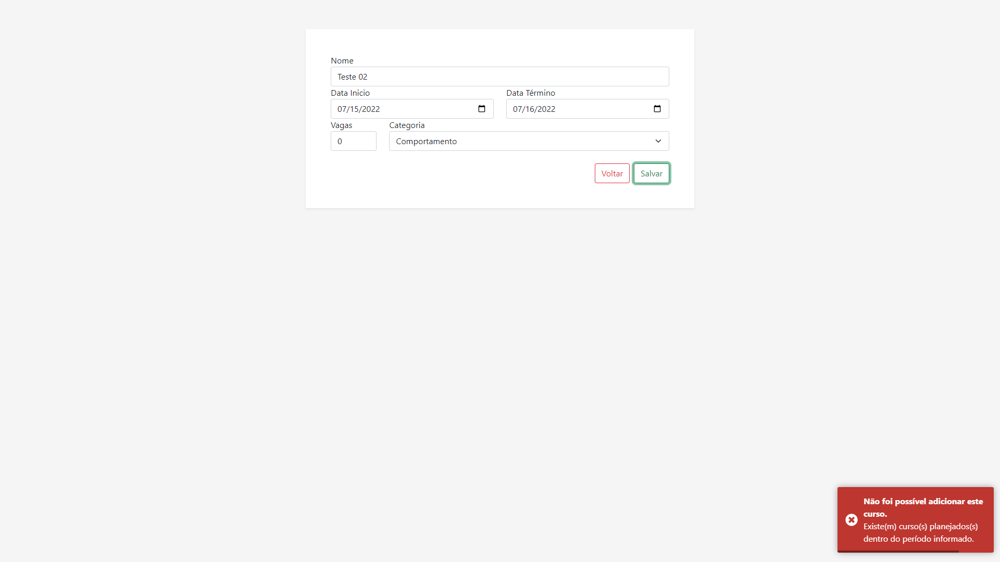
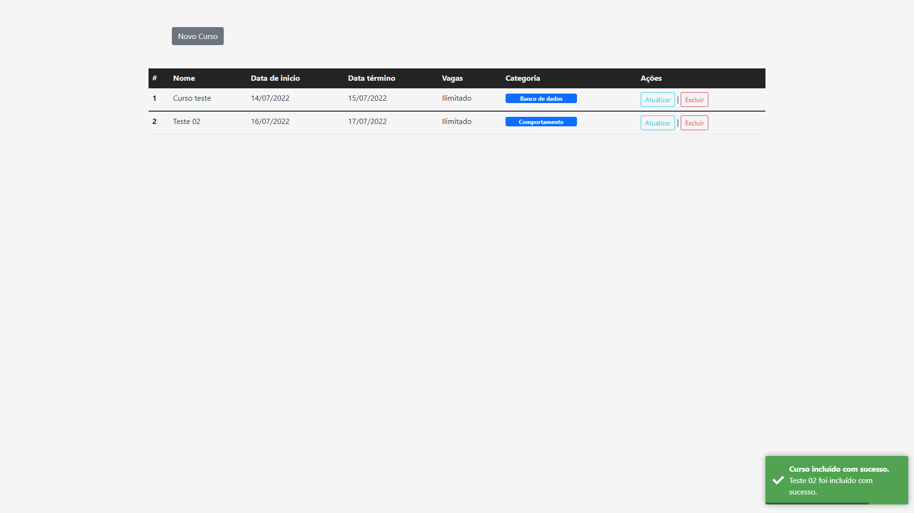
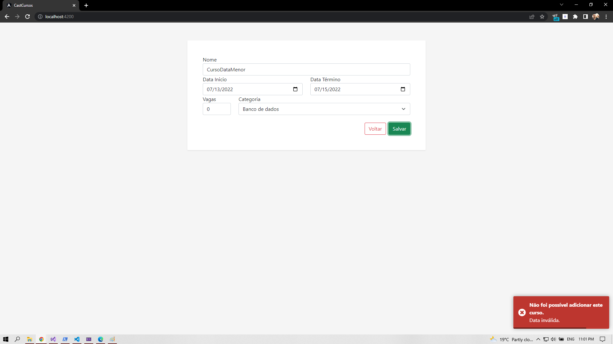

# CastCursos

Este projeto visa em gerenciar cursos que serão disponibilizados em uma plataforma. No mesmo será possível visualização de Logs com data da criação do curso e a data da última alteração do mesmo.


## Stack utilizada

**Front-end:** HTML, CSS, JavaScript/TypeScript e Angular

**Back-end:** .NET, ASP.NET Core WebApi


## Documentação

Conforme o foi o workflow neste projeto, será apresentado primeiro o back-end. A API foi desenvolvida com ASP.NET Core WebApi, com uso do .NET 6.


### Visão geral

A API conta com um padrão de projeto DTO (Data Transfer Object), este foi o padrão escolhido para ser implementado no projeto pro trazer uma arquitetura de Encapsulamento dos dados da aplicação, o que por sua vez, traz uma camada de segurança a mais.


### Endpoints

Os endpoints são os necessários para atender os requisitos dados pelo cliente. Os endpoints são endereçados em "/api/cursos" para tratar os cursos e, para tratar os logs, os endpoints se encontram em "/api/logs"

Neste primeiro momento, iremos tratar os endpoints dos cursos.


#### POST

O método POST é para que haja a inserção de um curso dentro do banco de dados. Os dados desta requisição são: Nome do curso, Data de início, Data de término, Vagas, e a Categoria que vem o no corpo da requisição.

Neste método, devemos seguir algumas regras de negócios, sendo elas:

* Impedir a criação de mais de um curso em um mesmo período;
* Impedir a criação de um curso com a data de conclusão menor que a data de início;
* Inserção na tabela de Log com a data de criação do curso.

Respeitando as exigências na regra de negócio, o método foi criado desta forma:
```
[HttpPost]
public IActionResult AdicionaCurso([FromBody] CreateCursoDto cursoDto)
{
    var curso = _mapper.Map<Curso>(cursoDto); // mapeia as informações da requisição para a classe modelo
    var cursosPorData = _context.Cursos.Where(c => ((curso.DataInicio >= c.DataInicio && curso.DataInicio <= c.DataTermino) ||
                                                   (curso.DataTermino >= c.DataInicio && curso.DataTermino <= c.DataTermino) ||
                                                   (c.DataInicio >= curso.DataInicio && c.DataInicio <= curso.DataTermino)) &&
                                                   (c.Status == true)); // seleção no banco de dados para garantir que não haja curso dentro deste período

    var cursoPorNome = _context.Cursos.Where(c => curso.Nome == c.Nome && c.Status == true);

    if (cursosPorData.Count() > 0)
    {
        return StatusCode(400, "Existe(m) curso(s) planejados(s) dentro do período informado.");
    } else if (cursoPorNome.Count() > 0)
    {
        return StatusCode(400, "Curso já cadastrado.");
    }
            
    if (curso.DataInicio >= DateTime.Now || curso.DataInicio <= curso.DataTermino)
    {
        curso.Status = true;
        _context.Cursos.Add(curso);
        _context.SaveChanges();

        var logDto = new CreateLogDto
        {
            CursoId = curso.Id,
            DataCriacao = DateTime.Now.Date,
            DataModificacao = null
        };

        var log = _mapper.Map<Log>(logDto);
        _context.Log.Add(log);
        _context.SaveChanges();

        return CreatedAtAction(nameof(RecuperaPorId), new { Id = curso.Id }, curso);
    }
            
    return StatusCode(400, "Data inválida.");
}
```

Com isso, todas as regras de negócio do cliente foram respeitas. Para garantir o funcionamento de todas fiz os testes que serão apresentados posteriormente.


#### GET

O GET neste momento só foram criado dois, um que retorne todos os cursos, e um para retornar com filtros de data. O primeiro que retorna todos os cursos apenas teve uma regra, que são os cursos que carregam com si o Status true, pois quando apagados, apenas é alterado o seu Status para false, assim, garante que o curso continuará no banco de dados para consultas posteriores.
```
[HttpGet]
public IActionResult RecuperaCursos()
{
    var cursos = _context.Cursos.Where(curso => curso.Status == true).ToList();

    if (cursos != null)
    {
        var cursosDto = _mapper.Map<List<ReadCursoDto>>(cursos);
        return Ok(cursosDto);
    }

    return NotFound();
}
```


#### PUT

No PUT é o método para atualização dos dados de um curso específico. Ele foi desenvolvido respeitando as mesmas regras de negócio para a criação de um curso novo. Porém neste é necessãrio a passagem do ID do curso quem vem junto da URL, por exemplo: /api/cursos/5

Este endpoint funciona como o POST, porém ele é para atualizar um recurso, e não adicionar. Quando este método é acionado, ele altera a data da última atualização no Log responsável por este curso.

```
[HttpPut("{id}")]
public IActionResult AtualizaCurso(int id, [FromBody] UpdateCursoDto cursoDto)
{
    var curso = _context.Cursos.FirstOrDefault(curso => curso.Id == id);
    if (curso == null)
    {
        return NotFound("Curso não encontrado.");
    }
            
    _mapper.Map(cursoDto, curso);

    var cursosPorData = _context.Cursos.Where(c => ((curso.DataInicio >= c.DataInicio && curso.DataInicio <= c.DataTermino) ||
                                                   (curso.DataTermino >= c.DataInicio && curso.DataTermino <= c.DataTermino) ||
                                                   (c.DataInicio >= curso.DataInicio && c.DataInicio <= curso.DataTermino)) &&
                                                   (c.Status == true && curso.Id != c.Id));

    if (cursosPorData.Count() > 0)
    {
        return StatusCode(400, "Existe(m) curso(s) planejados(s) dentro do período informado.");
    }

    var log = _context.Log.FirstOrDefault(log => log.CursoId == id);
    log.DataModificacao = DateTime.Now.Date;

    _context.SaveChanges();

    return NoContent();
}
```

#### DELETE

O método DELETE é autoexplicativo, se trata do endpoint responsável pela deleção de um determinado recurso, no nosso caso, de um curso. Conforme citado anteriormente, ele não faz de fato uma deleção do curso no banco de dados, na verdade ele altera o status do curso para false, sendo assim, todos os cursos que carregam consigo o status false será ignorado pela nossa aplicação.

```
[HttpDelete("{id}")]
public IActionResult DeletaCurso(int id)
{
    var curso = _context.Cursos.FirstOrDefault(curso => curso.Id == id);
    if (curso == null)
    {
        return NotFound();
    } else if (curso.DataTermino <= DateTime.Now)
    {
        return StatusCode(400, "Não é possível deletar um curso iniciado ou já finalizado.");
    }

    curso.Status = false;
    _context.SaveChanges();
    return NoContent();
}
```


Estes são os endpoins que tratam do nosso recurso Curso. No nosso log, apenas um endpoint está disponível pois ele será necessário apenas para leitura, sendo ele o GET que retorna todos os Logs registrados. Lembrando que há apenas um log por curso.

```
[HttpGet]
public IActionResult RecuperaLogs()
{
    var logs = _context.Log.ToList();

    if (logs != null)
    {
        var logsDto = _mapper.Map<List<ReadLogDto>>(logs);
        return Ok(logsDto);
    }

    return NotFound();
}
```

### Front-End

O front-end ficou bem simples, utilizando Angular com Bootstrap para estilizar, não há muito o que dizer, será apresentado na seção de demonstração.

### Demonstração

Fazendo o teste de inserção:
* Sem preencher um campo
  

* Ao preencher tudo corretamente
  

* Erro ao tentar inserir um curso que tem o mesmo período de outro
  

* Inserindo de forma correta
  

* Tentando atualizar ele para a mesma data de outro curso
  

* Tentando cadastrar um curso com uma data menor que a data atual
  